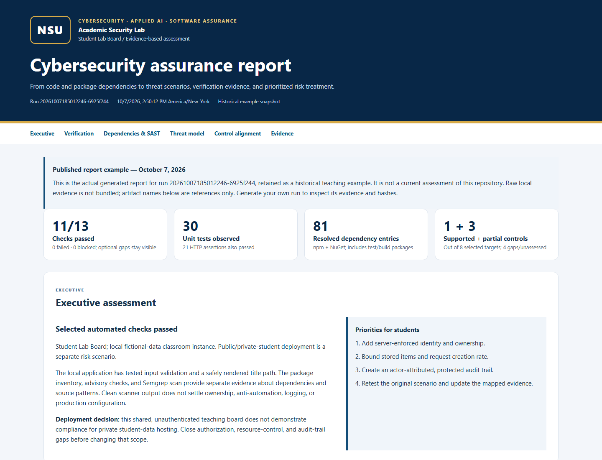

# Historical NSU assurance report example

Generated October 7, 2026 from run `20261007185012246-6925f244`. This snapshot is not a current repository assessment. Raw local evidence is not bundled. Open [the full HTML report](assurance-report.html) locally for executive findings, KPIs, dependency inventory, framework mappings, risk matrix, and control alignment.

# Academic assurance report

Run: 20261007185012246-6925f244

Created: 2026-10-07T18:50:12.249Z (UTC)

Domains: security, accessibility, performance, e2e

Source SHA-256: 17a3a8965bd929df98b51d6037e67f24fee97fcad428c57c0a9391dabac0110b

Source freshness: current

Parent baseline: 20261007184832345-2f730298

| Check | Area | Result | Scope |
| --- | --- | --- | --- |
| tools | shared | pass | tool/version inventory |
| verification | shared | pass | Vite, Vitest, .NET build/xUnit, and HTTP checks |
| dependencies | shared | pass | resolved npm and NuGet package inventory |
| semgrep-fixtures | security | pass | positive and negative rule fixtures |
| semgrep | security | pass | three local source rules; application files only |
| sonar | security | not-run | Optional local SonarQube Community Build; see docs/SONAR.md |
| kali-pentestgpt | security | not-run | Optional supervised Kali lab; see docs/KALI-LAB.md |
| npm-audit | security | pass | npm dependency advisory database |
| nuget-audit | security | pass | direct/transitive NuGet advisories |
| browser-security | security | pass | browser checks tagged @security |
| browser-accessibility | accessibility | pass | browser checks tagged @a11y |
| browser-performance | performance | pass | diagnostic timing collection; no regression verdict |
| browser-e2e | e2e | pass | browser checks tagged @e2e |

## Findings

No findings recorded. This is not evidence that manual review completed.

## Coverage limits

- Security source review and threat-model reasoning are agent tasks; record findings and reviewed scope separately. No secret scanner, exploitation, or production checks are implied.
- Axe covers empty, populated, complete, and request-error states. Loading, validation, keyboard focus, contrast review, screen-reader use, and zoom require additional/manual evidence. Axe incomplete results need review.
- Timing is a ten-sample localhost diagnostic of an empty board, not a baseline comparison, capacity result, or regression decision.

Evidence files and SHA-256 values are recorded in manifest.json. Original runs are retained; retests create new run folders. Local results do not establish production readiness, security certification, WCAG conformance, or performance equivalence.
